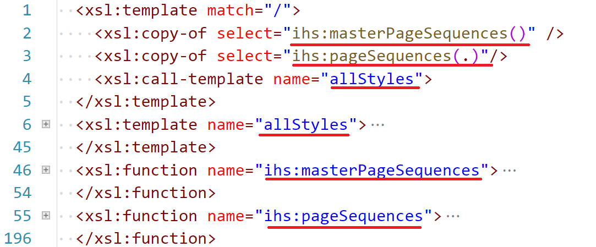

- title : XSLT - Use the Right Tool for the Job
- description : XSLT - Use the Right Tool for the Job
- author : Tomasz Heimowski
- theme : white
- transition : slide

***
- data-background : images/wrench.jpg

# XSLT
### Use the Right Tool for the Job

 
 
 
 

http://theimowski.com/

@theimowski

***
- data-background : images/intent.jpeg

## Intent
 

---

- data-background : images/dentist.jpg

' We often express reluctance for specific technology, avoid it and try different solutions, while we could have used a dedicated tool (technology) in a proper manner to tackle the problem efficiently.

---

- data-background : images/horizon.jpg

' This is not supposed to be a strictly technical talk, but I'd also like to send a message that we should be more open and reach for right tools when needed.  

---

- data-background : images/success.jpg

' To do so I'd like to share our success story with XSLT in PDF component in Phoenix, plus show a couple of tips & tricks while working with XSLT.

---

- data-background : images/alone.jpg

' I've deliberately chosen to present XSLT, to prove that you can do really cool stuff with even unfamous technologies

***
- data-background : images/context2.jpg

<h2>&emsp;&emsp;&emsp;Context</h2>
 
 
 

---

- data-background : images/firebird.jpg

' Show what we do in Phoenix project

---

- data-background : images/digitalpub.jpg

' Describe digital publishing and explain the importance of its automation in IHS

---

    
    &nbsp;↘&nbsp;

    
    &nbsp;→&nbsp;
    
    &nbsp;→&nbsp;
    
    &nbsp;→&nbsp;
    

' Present big picture of PDF publishing architecture in Phoenix
' Highlight the XSLT building block in PDF rendition flow

---

- data-background : images/beginner.jpg

' Review the level of knowledge at the beginning of working on the transform

---

- data-background : images/climbing.jpg

' Share how the approach advanced while developing the transform

---

- data-background : images/unconventional.jpg

' Note that we didn't stick to the conventional approach

---

- data-background : images/learning.jpg

' I'm not an expert

***
- data-background : images/profit.jpg

## Profit
 
 
 

---

    
    

---

    
    

---

    
    

---

## features

* 7 different report templates
* 1 or 2 column text flow
* 8 different layout options for tables and charts
* advanced page break manipulation
* table break manipulation
* facing pages option
* suppressing specific objects and pages
* table of contents configuration
* support for large tables
* more...

---

    
    

---

    

---

    

---

### numbers

* 3 IHS Domains
    * Chemical
    * Economics
    * Energy
* ~2.000 XSLT LOC
* ~2.000 PDF Reports Generated
* ~20.000 Pages of content
* Much more yet to come

' Chemical - complete migration of a legacy CMS hard to maintain

***
- data-background : images/practice.jpg

## Practice

' technical stuff
' tips & tricks
' biggest pains?
' solutions to some of the pains
' Utilize new xslt features

---

- data-background : images/explicit.jpg

---

### Implicit

' Conventional approach is to define multiple templates matching a pattern and rely on "apply-templates" instruction.
' However when a transform gets bigger and bigger it's hard to reason about those templates directly.
' Specially when the schemes of transform's input and output differ a lot.
' In addition one might get template matching conflicts which are not always easy to resolve - priorities.

---

### Explicit

---

- data-background : images/complex.jpg

' * Complex instructions
' * functional stuff in new XSLT
' * XPath power
' * Utilize functions
' * Static Typing capabilities
' * ? "Group by" capabilities

---

### XPath
#### Inovice sum

Input

    [lang=xml]
    <invoice>
      <product sku="001" price="12.50" quantity="2" />
      <product sku="002" price="10.00" quantity="2" />
      <product sku="003" price="35.00" quantity="3" />
      ...
    </invoice>

Expected output

    [lang=xml]
    150

---

#### Inovice sum - XSLT 1.0 with recursion

    [lang=xml]
    <xsl:template match="/invoice">
      <xsl:call-template name="sum">
        <xsl:with-param name="products" select="product" />
      </xsl:call-template>
    </xsl:template>
    <xsl:template name="sum">
      <xsl:param name="products" />
      <xsl:param name="acc" select="0" />
      <xsl:choose>
        <xsl:when test="not($products)">
          <xsl:value-of select="$acc" />
        </xsl:when>
        <xsl:otherwise>
          <xsl:variable name="price" select="$products[1]/@price" />
          <xsl:variable name="quantity" select="$products[1]/@quantity" />
          <xsl:call-template name="sum">
            <xsl:with-param name="products" select="$products[position() > 1]" />
            <xsl:with-param name="acc" select="$acc + ($quantity * $price)" />
          </xsl:call-template>
        </xsl:otherwise>
      </xsl:choose>
    </xsl:template>

' not going to analyze this snippet
' only need to know that recursion is used here
' explain algorithm with C#

---

#### Inovice sum - C# with recursion

    [lang=csharp]
    public static string Transform(XDocument xdoc)
    {
        return Sum(xdoc.Root.Elements("product"));
    }

    private static string Sum(IEnumerable<XElement> elements, decimal acc = 0)
    {
        if (elements.Any() == false)
        {
            return acc.ToString();
        }
        else
        {
            var product = elements.ElementAt(0);
            var price = decimal.Parse(product.Attribute("price").Value);
            var quantity = decimal.Parse(product.Attribute("quantity").Value);
            return Sum(elements.Skip(1), acc + price*quantity);
        }
    }

---

#### Invoice sum - C# LINQ expression

    [lang=csharp]
    public static string Transform(XDocument xdoc)
    {
        return
            xdoc.Root.Elements("product")
                .Select(product => 
                            decimal.Parse(product.Attribute("price").Value) * 
                            decimal.Parse(product.Attribute("quantity").Value))
                .Sum()
                .ToString();
    }

---

#### Inovice sum - XSLT 3.0 with XPath 3.1

    [lang=xml]
    <xsl:template match="/invoice">
      <xsl:value-of select="product!(@price * @quantity) => sum()"/>
    </xsl:template>

---

#### XPath features

* expressions: conditional, quantified, logic, etc...
* concise syntax
* list collect
* list map
* list filter
* functions
* arrow operator
* let bindings

http://www.saxonica.com/documentation/index.html#!expressions

' XPath is a language itself

---

### Functions
#### Finding most expensive product

Input

    [lang=xml]
    <invoice>
      <product sku="001" price="12.50" quantity="2" />
      <product sku="002" price="10.00" quantity="2" />
      <product sku="003" price="35.00" quantity="3" />
    </invoice>

Expected output

    [lang=xml]
    <product sku="003" price="35.00" quantity="3" />

---

#### Finding most expensive product - named template

    [lang=xml]
    <xsl:template match="/invoice">
      <xsl:call-template name="maxByPrice">
          <xsl:with-param name="products" select="product" />
      </xsl:call-template>
    </xsl:template>
    <xsl:template name="maxByPrice">
      <xsl:param name="products" />
      <xsl:copy-of select="$products[@price = max($products/@price)]" />
    </xsl:template>

---

#### Finding most expensive product - function

    [lang=xml]
    <xsl:template match="/invoice">
      <xsl:copy-of select="my:maxByPrice(product)" />
    </xsl:template>
    <xsl:function name="my:maxByPrice">
      <xsl:param name="products" />
      <xsl:copy-of select="$products[@price = max($products/@price)]" />
    </xsl:function>

---

#### XSLT Functions

* More concise syntax
* Can be used in XPath expressions
* Isolated - no implicit context nodes

---

### Static Typing

    [lang=xml]
    <xsl:template match="/invoice">
      <xsl:copy-of select="my:maxByPrice(.)" />
    </xsl:template>
    <xsl:function as="element(product)" name="my:maxByPrice">
      <xsl:param as="element(product)+" name="products" />
      <xsl:copy-of select="$products[@price = max($products/@price)]" />
    </xsl:function>

Static Error

    [lang=text]
    Static error at char 15 in xsl:copy-of/@select 
    on line 6 column 46 of static_typing.xslt:
        XPTY0004: Required item type of first argument 
        of my:maxByPrice() is element(Q{}product);
        supplied value has item type element(Q{}invoice)
    Errors were reported during stylesheet compilation

---

- data-background : images/tree.jpg

' Pessimist: Terse XML syntax
' Optimist: There are pros of XML syntax

---

### XML syntax
#### Applying discounts

Input

    [lang=xml]
    <invoice>
      <product sku="001" price="12.50" quantity="2" />
      <product sku="002" price="10.00" quantity="2" />
      <product sku="003" price="35.00" quantity="3" />
    </invoice>

* Get 30% discount for product with "002" sku
* Buy 3 for 2 products with "003" sku

Expected output

    [lang=xml]
    109

---

### Applying discounts

    [lang=xml]
    <!-- Declarative nature of XML -->
    <!-- Return plain XML -->
    <xsl:variable as="element(discount)+" name="discounts">
      <discount type="percent" sku="002" percent="30" />
      <discount type="XforY" sku="003" x="3" y="2" />
    </xsl:variable>
    
    <xsl:template match="/invoice">
      <xsl:copy-of select="my:applyDiscounts(product)" />
    </xsl:template>
    
    <xsl:function as="xs:double" name="my:applyDiscounts">
      <xsl:param as="element(product)+" name="products" />
      <xsl:copy-of select="$products!my:applyDiscount(.) => sum()" />
    </xsl:function>

' refactor the code - pass discount to applyDiscount function?

---

### Applying discounts

    [lang=xml]
    <xsl:function as="xs:double" name="my:applyDiscount">
      <xsl:param as="element(product)" name="product" /> 
      <xsl:copy-of select="
        let $discount := $discounts[@sku = $product/@sku],
            $price    := $product/@price,
            $quantity := $product/@quantity
        return
            if ($discount/@type = 'percent') then 
                (100 - $discount/@percent) div 100 * $price * $quantity
            else if ($discount/@type = 'XforY') then
                let $discounted := $quantity div $discount/@x,
                    $remaining  := $quantity mod $discount/@x
                return
                    $discounted * $price * $discount/@y + 
                    $remaining  * $price
            else
                $price * $quantity" />
    </xsl:function>

---

- data-background : images/diagnostics.jpg

' Pessimist: XSLT is Hard to diagnose
' Optimist: With FP I hardly need to debug. Also I can profile

---

#### Debugging

    [lang=xml]
    <xsl:function as="xs:double" name="my:applyDiscount">
      <xsl:param as="element(product)" name="product" /> 
      <xsl:message>--- sku: <xsl:value-of select="$product/@sku"/></xsl:message>
      <xsl:copy-of select="
        let $discount := my:debug('discount', $discounts[@sku = $product/@sku]),
          $price    := my:debug('price', $product/@price),
          $quantity := my:debug('quantity', $product/@quantity)
        return
          if ($discount/@type = 'percent') then 
            (100 - $discount/@percent) div 100 * $price * $quantity
          else if ($discount/@type = 'XforY') then
            let $discounted := $quantity div $discount/@x,
              $remaining  := $quantity mod $discount/@x
            return
              $discounted * $price * $discount/@y + 
              $remaining  * $price
          else
            $price * $quantity" />
    </xsl:function>

' red squares?

---

    [lang=xml]
    <xsl:function name="my:debug">
      <xsl:param name="msg" />
      <xsl:param name="x" />
      <xsl:message><xsl:value-of select="concat($msg, ': ', $x)"/></xsl:message>
      <xsl:copy-of select="$x" />
    </xsl:function>
    
---

    [lang=xml]
    --- sku: 001
    discount:
       price: <?attribute name="price" value="12.50"?>
    quantity: <?attribute name="quantity" value="2"?>
    --- sku: 002
    discount: <discount type="percent" sku="002" percent="30"/>
       price: <?attribute name="price" value="10.00"?>
    quantity: <?attribute name="quantity" value="2"?>
    --- sku: 003
    discount: <discount type="XforY" sku="003" x="3" y="2"/>
    quantity: <?attribute name="quantity" value="3"?>
       price: <?attribute name="price" value="35.00"?>

' concurrent execution? always same permutation

---

#### Profiling

---

- data-background : images/tooling.jpg

' Poor tooling
' Rather nothing more than standard XML tooling
' Use scripts for testing the transform
' Editor extensions?

---

---

---

- data-background : images/property.jpg

' Saxon's monopoly
' Supplements for free-version processor

---

#### Only in commercial Saxon Editions

* higher-order functions
* schema-awareness
* streaming
* various performance optimizations
* more extension points

http://www.saxonica.com/products/feature-matrix-9-6.xml

***
- data-background : images/recap.jpg

<h2 style="color: white">&nbsp;&nbsp;Recap</h2>

---

- data-background : images/tools.jpg

' lessons learned
' the very purpose of XSLT is to transform XML documents
' One can handle XSLT to use it without big pain
' It's not just about XSLT

---

- data-background : images/discover.jpg

' We don't have to avoid unknown tools / technologies
' We can discover interesting ways of using these tools to improve our process

---

- data-background : images/goal.jpg

' In the end what really matters is the final result that has business value