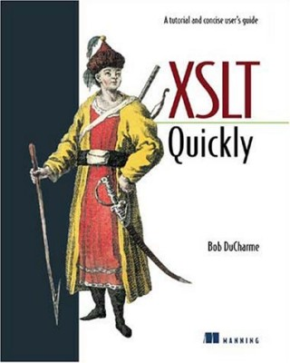
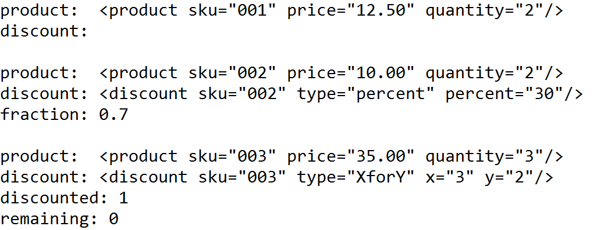

- title : XSLT - Use the Right Tool for the Job
- description : XSLT - Use the Right Tool for the Job
- author : Tomasz Heimowski
- theme : white
- transition : slide

***
- data-background : images/wrench.jpg

# XSLT

 
 
 
 
 

### Use the Right Tool for the Job

' Who knows what XSLT is?
' Who thinks XSLT is unpleasant?
' Who writes XSLT regularly?

---

### Tomasz Heimowski

http://theimowski.com/

@theimowski

' boast about FP, F#, OSS, GitBook?

***
- data-background : images/intent.jpeg

## Intent
 

' Divide talk into several parts
' Why I'm here talking XSLT
' What I'd like you to get from this talk

---

- data-background : images/dentist.jpg

' In my short carreer I've managed to spot
' 2 contrary (negative) attitudes: cool tech kids vs comfort zone 
' We often express reluctance for specific technology, avoid it and try different solutions, while we could have used a dedicated tool (technology) in a proper manner to tackle the problem efficiently.
' We avoid leaving comfort zone just as we avoid the dentists

---

- data-background : images/horizon.jpg

' This is not supposed to be a strictly technical talk, but I'd also like to send a message that we should be more open and reach for right tools when needed.  

---

- data-background : images/success.jpg

' To do so I'd like to share our success story with XSLT in PDF component in Phoenix, plus show a couple of tips & tricks while working with XSLT.

---

- data-background : images/alone.jpg

' Share the story about CFP for DevDay and "Come on, XSLT?"
' I'm happy to talk about niche XSLT, to prove that you can do really cool stuff with even unfamous technologies
' Interesting task, XSLT challenging and requires different thinking

***
- data-background : images/context2.jpg

<h2>&emsp;&emsp;&emsp;Context</h2>
 
 
 

' What we do
' What problem to solve
' Why XSLT

---

- data-background : images/firebird.jpg

' IHS Markit big corporation providing information in various domains
' PD&D dept primarily responsible for visualising and storing the information
' Many CMS inside company
' Show what we do in Phoenix project
' Phoenix to replace MANY (not all!) CMS in IHS Markit
' to UNIFY Authoring Experience 

---

- data-background : images/digitalpub.jpg

' One of most important aspects in Phoenix is Digital (Electronic) Publishing
' Two channels, focus on PDF
' Describe digital publishing and explain the importance of its AUTOMATION in IHS Markit

---

- data-background : images/bigpicture.png

' Present big picture of PDF publishing architecture in Phoenix
' Highlight the XSLT building block in PDF rendition flow
' Mention Full auto and SEMI AUTO layout

---

- data-background : images/beginner.jpg

' Review the level of knowledge at the beginning of working on the transform
' Challenge accepted

---

## XSLT Quickly

https://amzn.com/1930110111

#### based on xslt 1.0 !

---

- data-background : images/climbing.jpg

' Share how the approach advanced while developing the transform
' Start with XSLT 1.0, then moved iteratively to 2.0
' Functional Programming influenced the approach
' Continuous delivery pipeline - how many deployments, fast feedback loop, F# scripts, going forward without rolling back
' Continuous delivery demo

---

- data-background-video : images/capture.wmv

## PDF Diff DEmo

---

- data-background : images/unconventional.jpg

' Note that we didn't stick to the conventional approach
' Influence of FP

---

- data-background : images/learning.jpg

' I'm not an expert
' Many other smart people
' I'm still learning
' But this experience lets me share a few XSLT tips

***
- data-background : images/profit.jpg

## Profit
 
 
 

' Results drive motivation

---

#### Template: Full Cover

---

#### Template: Masthead with Right pane

---

#### Template: Masthead with few contacts

---

#### Template: Masthead with more contacts

---

#### Template: Masthead with 2 columns

---

#### Template: Masthead for specific brand

---

#### Columns: 1 column text flow

---

#### Columns: 2 columns text flow

---

#### Charts & tables layout: Centered

    
    

---

#### Charts & tables layout: aligned Left

    
    

---

#### Charts & tables layout: aligned Right

    
    

---

#### Charts & tables layout: Grouped

    
    

---

#### Charts & tables layout: Full width

    
    

---

#### Charts & tables layout: Landscape

    

---

#### Running heads: facing pages

    

---

## and many more features...

---

### numbers

* ~2.000 XSLT LOC
* 3 IHS Markit Domains
    * Chemical
    * Economics
    * Energy
* ~2.000 PDF Reports Generated
    * 1 page long (smallest report)
    * 300 pages long (largest report)
* ~20.000 Pages of content
* Much more yet to come

' Chemical - complete migration of a legacy CMS hard to maintain
' Some of those reports cost a lot of money

***
- data-background : images/practice.jpg

## Practice

' technical stuff
' will be snippets - don't need to follow up
' tips & tricks
' biggest pains?
' solutions to some of the pains
' Main theme: Utilize new xslt features, think functional

---

### Implicit

' Conventional approach is to define multiple templates matching a pattern and rely on "apply-templates" instruction.
' Fine for simple transforms, input similar to output.
' However when a transform gets bigger and bigger it's hard to reason about those templates directly.
' Specially when the schemes of transform's input and output differ a lot.
' In addition one might get template matching conflicts which are not always easy to resolve - priorities.

---

### Explicit

---

- data-background : images/complex.jpg

' * Complex instructions
' * functional stuff in new XSLT
' * XPath power
' * Utilize functions
' * Static Typing capabilities
' * ? "Group by" capabilities

---

### XPath
#### Inovice sum

Expected sum: *150*

---

#### Inovice sum - XSLT 1.0 with recursion

' not going to analyze this snippet
' only need to know that recursion is used here
' explain algorithm with C#

---

#### Inovice sum - C# with recursion

---

#### Invoice sum - C# LINQ expression

---

#### Inovice sum - XSLT 3.0 with XPath 3.1

---

#### XPath features

* expressions: conditional, quantified, logic, etc...
* concise syntax
* list collect
* list map
* list filter
* functions
* arrow operator
* let bindings

http://www.saxonica.com/documentation/index.html#!expressions

' XPath is a language itself

---

#### Formatting richtext - named templates

---

#### Formatting richtext - functions

---

#### XSLT Functions

* More concise syntax
* Can be used in XPath expressions
* Isolated - no implicit context nodes

---

### Static Typing

---

- data-background : images/tree.jpg

' Pessimist: Terse XML syntax
' Optimist: There are pros of XML syntax

---

### XML syntax
#### Applying discounts

* Get 30% discount for product with "002" sku
* Buy 3 for 2 products with "003" sku
* Expected sum after discounts: *109*

---

### Applying discounts

    
---

### Applying discounts

' Also good for returning bigger chunks of bare XML
' Mixing XPath code with XML syntax = more concise

---

- data-background : images/diagnostics.jpg

' Pessimist: XSLT is Hard to diagnose
' Optimist: With FP I hardly need to debug. Also I can profile

---

#### Debugging

' red squares?

---

---

---

#### Profiling

---

- data-background : images/tooling.jpg

' Poor tooling
' Oxygen XML Editor
' Rather nothing more than standard XML tooling
' tooling might not be crucial - code is not so terse anymore
' Use scripts for testing the transform
' Editor extensions?

---

---

---

- data-background : images/property.jpg

' Saxon's monopoly
' Supplements for free-version processor

---

#### Only in commercial Saxon Editions

* higher-order functions
* schema-awareness
* streaming
* various performance optimizations
* more extension points

http://www.saxonica.com/products/feature-matrix-9-6.xml

***
- data-background : images/recap.jpg

<h2 style="color: white">&nbsp;&nbsp;Recap</h2>

' lessons learned

---

- data-background : images/tools.jpg

' the very purpose of XSLT is to transform XML documents
' One can handle XSLT to use it without big pain
' It's not just about XSLT

---

- data-background : images/stars.jpg

' We don't have to avoid unknown tools / technologies
' We can discover interesting ways of using these tools to improve our process

---

- data-background : images/goal.jpg

' In the end what really matters is the final result that has business value